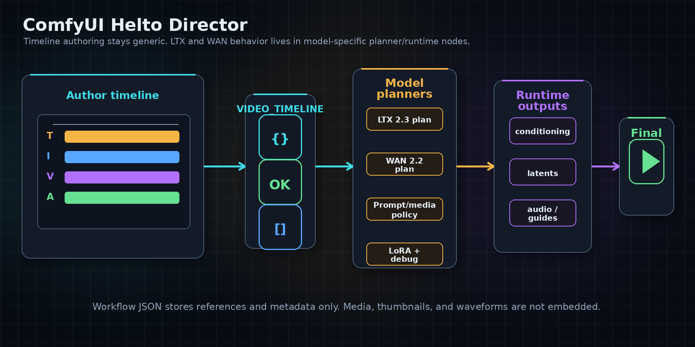

# ComfyUI Helto Director

ComfyUI Helto Director is a video timeline node pack for planning longer,
structured video generations inside ComfyUI. It gives you a Director timeline
for text, image, video, audio, references, LoRAs, shots, takes, and sequence
assembly, then hands a generic `VIDEO_TIMELINE` contract to model-specific LTX
2.3 or WAN 2.2 planner/runtime nodes.



The core idea is simple: author the story once in a generic timeline, then let
the model family decide how that timeline becomes conditioning, latents, guide
data, debug output, segmented runs, or final assembled clips.

## What You Can Do

- Build a timeline from Text, Image, Video, and Audio Sections.
- Attach media through the Director UI without embedding media payloads in
  workflow JSON.
- Use prompt optimization, character/reference images, privacy mode, and
  timeline library tools directly from the Director interface.
- Plan and run LTX 2.3 timeline workflows with source-video guidance, audio
  mixing/native-audio checks, identity anchors, and segmented execution.
- Plan and run supported WAN 2.2 workflows with Prompt Relay, Start/End image
  conditioning, Bernini task prompting, high/low model phase patching, and
  runtime debug output.
- Capture generated outputs as shot takes, accept the best takes, and assemble
  accepted generated clips plus imported clips into a final sequence.
- Keep model-specific behavior out of the generic Director node.


## Installation

Clone this repository into your ComfyUI custom nodes folder:

```bash
cd ComfyUI/custom_nodes
git clone https://github.com/helto4real/comfyui-helto-director
```

Restart ComfyUI after cloning. The nodes appear under the `timeline/*`
categories, with the main authoring node named `Video Timeline Director`.

For a first-run walkthrough, see [Getting Started](docs/getting_started.md).


## Quick Start

1. Add `Video Timeline Director`.
2. Set a short duration, frame rate, aspect ratio, orientation, and quality
   preset.
3. Open the Director timeline UI and add Text, Image, Video, or Audio Sections.
4. Attach media through the picker buttons when needed.
5. Wire the Director output into either the LTX 2.3 or WAN 2.2 config, planner,
   and runtime path.
6. Start with a short project or WAN `Plan Only` mode until your model and media
   wiring is correct.

Example graph paths:

- LTX: `Video Timeline Director -> LTX 2.3 Timeline Config -> LTX 2.3 Timeline Planner -> LTX 2.3 Timeline Runtime`
- WAN: `Video Timeline Director -> WAN 2.2 Timeline Config -> WAN 2.2 Timeline Planner -> WAN 2.2 Timeline Runtime`
- Takes: model runtime output -> `Timeline Take Capture` -> accepted takes
- Assembly: `VIDEO_TIMELINE` with accepted/imported clips -> `Timeline Sequence Assembler`

## Workflow Examples

Importable example workflows live in [docs/workflows](docs/workflows/README.md).
They are starting points, not bundled model/media packages. Replace placeholder
checkpoints, VAEs, text encoders, and media paths with files installed in your
local ComfyUI setup before queueing.

Good first examples:

- `wan_plan_only_workflow.json` for a safe WAN planning/debug pass.
- `wan_i2v_text_first_image_workflow.json` for the main supported WAN Core I2V
  path.
- `ltx_text_only_workflow.json` for a minimal LTX timeline path.
- `ltx_image_video_audio_workflow.json` for media-rich LTX planning.
- `ltx_identity_reference_workflow.json` for LTX identity/reference helper
  wiring.

## Node Families

See [Node Reference](docs/node_reference.md) for a grouped list of current
nodes, inputs, outputs, and when to use each one.

At a high level:

- Director nodes author and validate generic timeline state.
- LTX nodes turn `VIDEO_TIMELINE` into LTX 2.3 planning and runtime outputs.
- WAN nodes turn `VIDEO_TIMELINE` into WAN 2.2 planning and supported runtime
  outputs.
- Tool nodes handle LoRA configuration, take capture, and sequence assembly.
- Identity/reference helper nodes support LTX workflows without making the
  Director itself LTX-specific.

## Media And Privacy

The Director stores media as project `assets[]` records. Workflow JSON stores
references and metadata only. It does not embed original media files,
thumbnails, waveform arrays, video bytes, image bytes, audio bytes, blobs, or
data URLs.

Original media stays where it already lives. Preview thumbnails and waveforms
are cache data. Privacy Mode is enabled by default for new Director projects:
private timeline state is encrypted in the hidden `video_timeline_json` widget
and UI previews are masked outside the relevant Director/picker/optimizer
surfaces.

Read more:

- [Media picker setup](docs/picker_setup.md)
- [Privacy mode limitations](docs/privacy_limitations.md)

## Model Support

Helto Director keeps the Director generic. Model-specific policy belongs in the
model-specific config, planner, runtime, and executor nodes.

- [LTX 2.3 Timeline Workflow Guide](docs/examples/ltx_timeline_workflow_guide.md)
  covers graph wiring, source-video extension, audio behavior, prompt
  optimization, privacy mode, and identity/reference helpers.
- [WAN 2.2 Timeline Support](docs/WAN22_SUPPORT.md) covers WAN defaults,
  backend profiles, Prompt Relay, Bernini, visual keyframes, runtime wiring, and
  current backend limits.
- [Current limitations](docs/current_limitations.md) explains supported and
  unsupported behavior across timeline terms, LoRAs, shots/takes, LTX, WAN, and
  examples.

## Shots, Takes, And Assembly

Shot-based generation is additive: you can still generate the full timeline, or
you can target a selected shot from the LTX/WAN planner. Generated outputs can
be registered as takes, accepted on a shot, and later assembled alongside
imported clips.

See [Shot, Take, And Sequence Workflow](docs/shot_take_sequence_workflow.md).

## Troubleshooting

- Node pack does not load: restart ComfyUI and check the terminal for import
  errors.
- Nodes are missing: confirm the repository folder is directly under
  `ComfyUI/custom_nodes` and not nested one level deeper.
- Example workflow errors before generation: replace placeholder model and media
  filenames with local files.
- WAN runtime is confusing: start with `Plan Only` and inspect planner/runtime
  debug before switching to `ComfyUI Core`.
- WAN I2V Core says image conditioning is missing: add at least one Image
  Section or use a text-capable mode/path.
- Media loading fails: reselect the file if it was moved, renamed, or no longer
  readable by ComfyUI.
- Privacy mode content appears in clear text: stop, check that Privacy Mode was
  not explicitly disabled before saving, and review
  [Privacy mode limitations](docs/privacy_limitations.md).

## Docs Map

- [Getting Started](docs/getting_started.md)
- [Node Reference](docs/node_reference.md)
- [Workflow examples](docs/workflows/README.md)
- [LTX 2.3 Timeline Workflow Guide](docs/examples/ltx_timeline_workflow_guide.md)
- [WAN 2.2 Timeline Support](docs/WAN22_SUPPORT.md)
- [Shot, take, and sequence workflow](docs/shot_take_sequence_workflow.md)
- [Media picker setup](docs/picker_setup.md)
- [Privacy mode limitations](docs/privacy_limitations.md)
- [Current limitations](docs/current_limitations.md)
- [WAN 2.2 manual test checklist](docs/WAN22_MANUAL_TEST_CHECKLIST.md)

## Developer Context

See [AGENTS.md](AGENTS.md) for the compact agent routing guide, code
boundaries, and validation commands.
