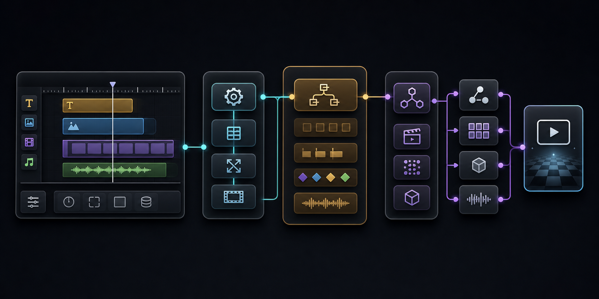
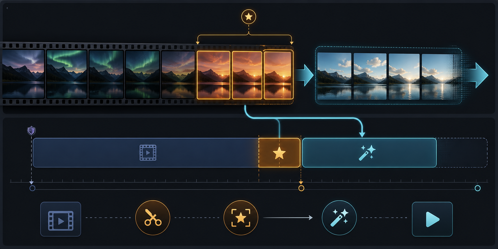
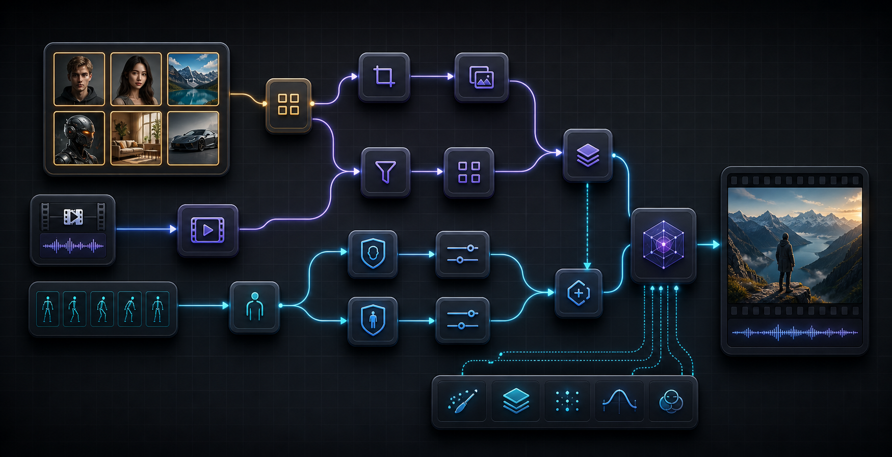
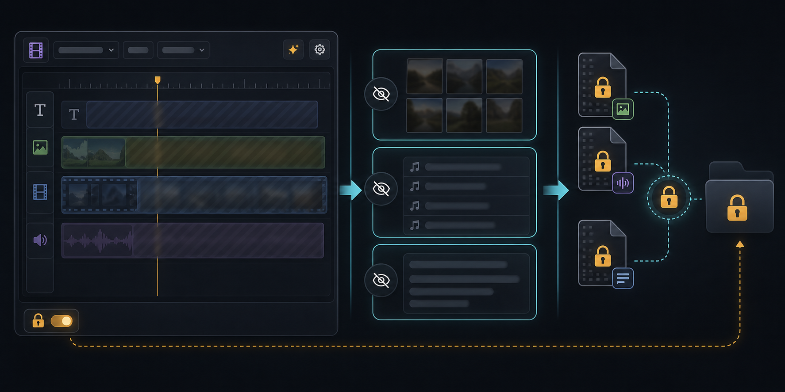

# LTX 2.3 Timeline Workflow Guide

This guide covers the current practical LTX Timeline path: generic timeline authoring in
`Video Timeline Director`, model-specific planning in the LTX nodes, runtime guide/audio
materialization, prompt optimization, privacy mode, and the identity/reference helpers.

If you are new to the node pack, start with [Getting Started](../getting_started.md)
and [Node Reference](../node_reference.md) before wiring the full LTX path.

## Minimal Graph

Wire the Helto nodes in this order:

1. `Video Timeline Director`
2. `LTX 2.3 Timeline Config`
3. `LTX 2.3 Timeline Planner`
4. `LTX 2.3 Timeline Runtime`

Connect:

- Director `VIDEO_TIMELINE` to Planner `VIDEO_TIMELINE`.
- Config `LTX_TIMELINE_CONFIG` to Planner `LTX_TIMELINE_CONFIG`.
- Planner `LTX_TIMELINE_PLAN` to Runtime `LTX_TIMELINE_PLAN`.
- LTX model loader outputs to Runtime `model`, `clip`, and `vae`.
- Optional Audio VAE loader output to Runtime `audio_vae` when audio latents are needed.
- Optional custom negative conditioning to Runtime `negative`; leave it disconnected to use the runtime's internal zeroed negative conditioning.

Use a short project first: `1.0` to `2.0` seconds, `24` fps, and `Quick Draft`.

## Timeline Recipes

### Text Only

Add one Text Section that covers the whole project duration. Put the local scene action in the section prompt. The runtime patches the model for Prompt Relay when enabled and returns `positive`, `negative`, `video_latent`, `combined_audio`, `audio_latent`, `guide_data`, and `runtime_context`.

### Image Guided Sections

Add an Image Section, choose an image from the picker, set a nonzero guide strength, and add a prompt that describes the desired motion. Image Sections produce `guide_data.reference_images`, apply guide metadata to conditioning/latent outputs, and can be selected later by the reference helper nodes.

### Source Video Extension

For video extension workflows:

1. Set Project Duration to the continuation length only.
2. Add a Video Section covering the whole project duration.
3. Attach the original source video.
4. Keep `Guidance Range` at the default `Last Frames`.
5. Start with `Guide Frames` at `17` and `Guide Strength` around `0.8`.
6. Use `Use Source Timing` to preserve tail motion, or `Freeze Last Frame` when the continuation should anchor more strongly on the final source frame.

`Last Frames` means the last frames of the trimmed source range. If `Source In` and `Source Out` are set, the tail is taken from that trimmed range, not necessarily the absolute end of the file. Use `Full Source Range` only when the whole trimmed video should guide the section.

### Provided Audio And Native Audio

- For provided audio, add audio clips in the Director timeline and keep `Use Native Audio` off.
- For native audio, turn `Use Native Audio` on and use an LTX audio-video model that supports native audio.
- Missing `audio_vae` does not block provided-audio mixing, but the runtime returns an empty audio latent placeholder and records a diagnostic.
- Native audio on an unsupported model fails clearly by design.

## Prompt Optimizer

Use the sparkle button in the Director toolbar to open the prompt optimizer. It builds rows from Director Track sections, uses image/video context when available, and applies generated prompts back through normal timeline mutation so undo, validation, hidden widget serialization, and dirty-canvas behavior still work.

Recommended workflow:

1. Rough in Text, Image, and Video Sections.
2. Attach media before generating optimizer prompts.
3. Select the rows you want to optimize.
4. Generate prompts.
5. Review/edit generated text.
6. Apply selected rows.

Image and video thumbnails are visual context only. Exact technical instructions should stay in the section prompts and workflow guide, not in generated thumbnails.

## Identity And Reference Helpers

Identity/reference helper nodes stay separate from the Director:

- `LTX 2.3 Timeline Reference Image Selector` selects an image from Runtime `guide_data`.
- `LTX 2.3 Timeline Identity Anchor: Latent Aware` builds a latent-aware identity anchor config.
- `LTX 2.3 Timeline Identity Anchor: Face` builds a face-region identity anchor config.
- `LTX 2.3 Timeline Identity Anchor: Combine` combines multiple anchor configs.
- `LTX 2.3 Timeline Apply Identity Anchor` applies an identity anchor to a model outside the runtime path.
- `LTX 2.3 Timeline Crop Reference Tail` crops reference-tail latent frames after runtime guide/reference use.

For the runtime path, connect the combined or single `LTX_IDENTITY_ANCHOR` to the Runtime `identity_anchor` input, and connect `sigmas` and `vae` when the selected anchor needs them. The runtime builds `guide_data` first, then applies the identity anchor to the model.

## Privacy Mode

Privacy Mode is enabled by default for new Director projects. Keep it on when timeline content should be hidden outside the node/picker/modal hover area.

While enabled:

- The timeline and prompt text are masked while the cursor is outside the Director node.
- Picker thumbnails and audio filenames are masked while the cursor is outside the picker panel.
- Prompt optimizer thumbnails and prompt text are masked while the cursor is outside the optimizer panel.
- Timeline JSON saved in the hidden widget is encrypted locally.
- Preview thumbnails and waveforms are encrypted in ComfyUI temp under `helto_timeline_director`.

Privacy Mode protects this nodepack's timeline state and preview cache. It does not encrypt unrelated ComfyUI nodes or external media files.

## Expected Failures

- Missing media files fail with `Media file not found: ...`.
- Invalid planner validation fails before runtime materialization.
- Video files without a video stream fail with a clear no-video-stream error.
- `Use Native Audio` with a non-native-audio LTX model fails with a clear unsupported-model error.
- Missing `audio_vae` records a runtime diagnostic and returns an empty audio latent placeholder.

## Debugging Checklist

- If a prompt after a media section feels ignored, put a continuity prompt on the media section too. New Video Sections default to a continuation-style prompt.
- If source-video extension uses the wrong tail frames, check `Source In`, `Source Out`, `Guidance Range`, and `Guide Frames`.
- If generated duration is wrong, remember that Project Duration is the generated output duration, not source duration plus output duration.
- If identity helpers cannot find a reference, inspect Runtime `guide_data.reference_images` and use the selector's available labels/ids.
- If privacy content appears in clear text, stop and check that `Privacy Mode` was not explicitly turned off before saving the workflow.
