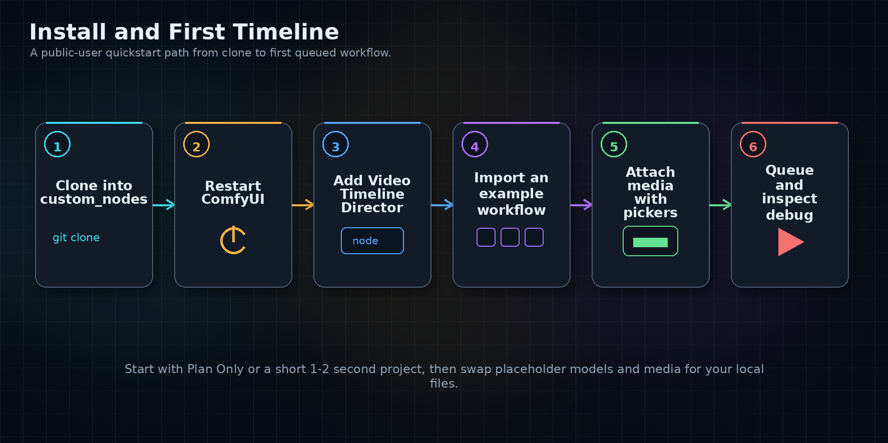

# Getting Started

This guide gets you from a fresh clone to a first timeline workflow. For the
full node list, see [Node Reference](node_reference.md).



## Install

Clone the node pack into ComfyUI's custom nodes directory:

```bash
cd ComfyUI/custom_nodes
git clone https://github.com/helto4real/comfyui-helto-director
```

Restart ComfyUI after cloning. In the node search, look for:

- `Video Timeline Director`
- `LTX 2.3 Timeline Config`
- `LTX 2.3 Timeline Planner`
- `LTX 2.3 Timeline Runtime`
- `WAN 2.2 Timeline Config`
- `WAN 2.2 Timeline Planner`
- `WAN 2.2 Timeline Runtime`

If the nodes do not appear, check the ComfyUI terminal for import errors and
confirm the repository is not nested inside another folder.

## Create Your First Timeline

1. Add `Video Timeline Director`.
2. Set a short `Duration`, such as `1.0` to `2.0` seconds.
3. Set `Frame Rate`, `Aspect Ratio`, `Orientation`, and `Quality Preset`.
4. Open the Director timeline UI.
5. Add one Text Section that covers the whole project duration.
6. Queue a plan-only or short workflow before scaling up.

The Director output is a generic `VIDEO_TIMELINE`. It is not an LTX or WAN node
by itself. Model-specific behavior starts when you connect that output to an
LTX or WAN planner.

## Try An Example Workflow

Example workflows live in [workflows](workflows/README.md). Import one into
ComfyUI, then replace placeholder model and media names with files installed in
your local setup.

Recommended first examples:

- `wan_plan_only_workflow.json`: safest WAN first run. It validates and reports
  debug information without requiring full runtime conditioning.
- `wan_i2v_text_first_image_workflow.json`: supported WAN Core I2V path with a
  first image keyframe.
- `ltx_text_only_workflow.json`: minimal LTX planner/runtime chain.
- `ltx_image_video_audio_workflow.json`: LTX timeline with image, video, and
  audio media references.

## Attach Media

Use the Director toolbar buttons and section controls to choose images, videos,
and audio files. Selected files become timeline assets referenced by `asset_id`.
The workflow stores references and metadata only; it does not store media bytes,
thumbnails, or waveform arrays.

For folder behavior and picker expectations, read [Media Picker Setup](picker_setup.md).

## Choose A Model Path

Use LTX when you want the LTX 2.3 timeline path, source-video guidance,
timeline audio handling, or LTX identity/reference helper nodes. Start with the
[LTX 2.3 Timeline Workflow Guide](examples/ltx_timeline_workflow_guide.md).

Use WAN when you want WAN 2.2 Prompt Relay planning, WAN visual keyframe debug,
Bernini task prompting, or the supported ComfyUI Core WAN runtime path. Start
with [WAN 2.2 Timeline Support](WAN22_SUPPORT.md).

## Keep First Runs Small

For first tests, use short durations and small workflows:

- LTX: start with one Text Section and a short duration.
- WAN: start in `Plan Only` backend mode.
- Media workflows: attach one image or video before trying multi-section edits.
- Privacy workflows: enable Privacy Mode before saving private workflow state.

## Common Setup Problems

- `No module named ...`: the node pack did not import. Check the ComfyUI
  terminal traceback.
- Nodes do not appear: restart ComfyUI after cloning.
- Workflow example cannot find a model: replace placeholder filenames with your
  local checkpoint, VAE, text encoder, or media names.
- WAN Core refuses text-only I2V: default `I2V-A14B` Core execution needs at
  least one Image Section.
- Media path no longer works: reselect the moved or renamed file in the
  Director picker.
- Private prompts are visible outside the Director: review
  [Privacy Mode Limitations](privacy_limitations.md).

## Next Steps

- Learn the main node families in [Node Reference](node_reference.md).
- Read current support boundaries in [Current Limitations](current_limitations.md).
- Build shot-based workflows with [Shot, Take, And Sequence Workflow](shot_take_sequence_workflow.md).
