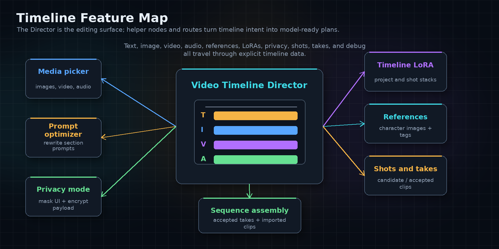

# Node Reference

This page groups the current Helto Director nodes by workflow role. The
Director stays generic; LTX and WAN behavior belongs in their own model-specific
nodes.

## Director

### Video Timeline Director

Category: `timeline/director`

Use this as the main timeline authoring node. It owns project duration, frame
rate, aspect ratio, orientation, quality preset, and the hidden
`video_timeline_json` payload used by the browser timeline UI.

Outputs:

- `VIDEO_TIMELINE`: normalized generic timeline data.
- `TIMELINE_VALIDATION`: validation results for timeline consumers.
- `frame_rate`: the resolved timeline frame rate.

The Director should stay model-agnostic. It does not contain LTX-only or
WAN-only logic.

### Timeline LoRA Configuration

Category: `timeline/director`

Use this helper to build a reusable LoRA configuration payload. The Director
timeline can store project and shot LoRA intent; model-specific runtime paths
decide how those stacks map to model targets.

Output:

- `HELTO_LORA_CONFIG`

## LTX 2.3

### LTX 2.3 Timeline Config

Category: `timeline/ltx`

Defines LTX-specific planning policy such as resolution profile, Prompt Relay
epsilon, image guidance mode, video section mode, reference mode, audio mode,
maximum generation duration, debug mode, and segmented continuity/seam settings.

Output:

- `LTX_TIMELINE_CONFIG`

### LTX 2.3 Timeline Planner

Category: `timeline/ltx`

Converts generic `VIDEO_TIMELINE` plus `LTX_TIMELINE_CONFIG` into a serializable
LTX plan. Use `shot_id` in planner workflows when generating one selected shot;
leave it empty for full-timeline generation.

Outputs:

- `LTX_TIMELINE_PLAN`
- `TIMELINE_VALIDATION`
- `DEBUG_INFO`

### LTX 2.3 Timeline Runtime

Category: `timeline/ltx`

Materializes an LTX plan into ComfyUI runtime objects. It accepts model, CLIP,
VAE, optional negative conditioning, optional latent, optional Audio VAE,
optional identity anchor, sigmas, and optional IC-LoRA parameters.

Outputs include patched model, positive/negative conditioning, video latent,
audio latent, combined audio, guide data, source-video outputs, and
`runtime_debug`.

### LTX 2.3 Timeline Segmented Executor

Category: `timeline/ltx`

Runs segmented LTX generations and stitches decoded frames. Use it when the
timeline should execute in sections instead of manually wiring each runtime pass.

Outputs:

- `images`
- `audio`
- `frame_rate`
- `executor_debug`

## LTX Identity And Reference Helpers

These nodes support LTX workflows without making the Director itself LTX-specific.

### LTX 2.3 Timeline Reference Image Selector

Selects a reference image from LTX runtime `guide_data`.

### LTX 2.3 Timeline Identity Anchor: Latent Aware

Builds a latent-aware identity anchor configuration for LTX workflows.

### LTX 2.3 Timeline Identity Anchor: Face

Builds a face-region identity anchor configuration for LTX workflows.

### LTX 2.3 Timeline Identity Anchor: Combine

Combines multiple LTX identity anchor configurations.

### LTX 2.3 Timeline Apply Identity Anchor

Applies a configured identity anchor to an LTX model outside the main runtime
path.

### LTX 2.3 Timeline Crop Reference Tail

Crops reference-tail latent frames after runtime guide/reference use and reports
the visible frame count for downstream video output.

For practical wiring, read the
[LTX 2.3 Timeline Workflow Guide](examples/ltx_timeline_workflow_guide.md).

## WAN 2.2

### WAN 2.2 Timeline Config

Category: `timeline/wan`

Defines WAN-specific planning and runtime policy, including resolution profile,
model mode, Prompt Relay, Bernini task prompt, visual conditioning, unsupported
feature policies, audio policy, runtime backend profile, debug mode, segmented
continuity/seam settings, painter motion options, VRAM unload policy, and FMLF
continuation mode.

Output:

- `WAN_TIMELINE_CONFIG`

### WAN 2.2 Timeline Planner

Category: `timeline/wan`

Converts generic `VIDEO_TIMELINE` plus `WAN_TIMELINE_CONFIG` into a serializable
WAN plan. It preserves prompt relay, keyframe, audio, media, validation, and
debug information for the selected backend path.

Outputs:

- `WAN_TIMELINE_PLAN`
- `TIMELINE_VALIDATION`
- `DEBUG_INFO`

### WAN 2.2 Timeline Runtime

Category: `timeline/wan`

Materializes supported WAN plans into ComfyUI runtime conditioning objects. It
accepts optional high-noise and low-noise model phases, optional CLIP, optional
VAE, a `WAN_TIMELINE_PLAN`, optional negative conditioning, and batch size.

Outputs:

- `high_noise_model`
- `low_noise_model`
- `positive`
- `negative`
- `video_latent`
- `runtime_debug`

### WAN 2.2 Timeline Segmented Executor

Category: `timeline/wan`

Runs segmented WAN/Bernini generations and stitches decoded frames. It exposes
sampling settings, phase split step, seed mode, batch size, model phase inputs,
CLIP, VAE, and `WAN_TIMELINE_PLAN`.

Outputs:

- `images`
- `audio`
- `frame_rate`
- `executor_debug`

For supported backend behavior and known limits, read
[WAN 2.2 Timeline Support](WAN22_SUPPORT.md).

## Takes And Assembly

### Timeline Take Capture

Category: `timeline/tools`

Registers generated media as a shot take and writes a sidecar that the Director
UI can attach. It can accept runtime debug metadata, video/images/audio outputs,
a generated asset path, optional shot override, filename prefix, and accept/clip
update settings.

Outputs:

- updated `VIDEO_TIMELINE`
- `video`
- `asset_id`
- `take_id`
- `DEBUG_INFO`

### Timeline Sequence Assembler

Category: `timeline/tools`

Assembles accepted generated takes and imported clip instances into final video
components. It reads `VIDEO_TIMELINE`, applies a missing-take policy, and
returns video, image frames, audio, frame rate, debug info, and whether a video
was assembled.

For the full workflow, read
[Shot, Take, And Sequence Workflow](shot_take_sequence_workflow.md).

## Data And Storage Rules

Timeline workflow JSON stores references and metadata only. It should not embed
media payloads, thumbnails, waveform arrays, blobs, or data URLs.

Privacy Mode encrypts private Director timeline state and preview cache created
by this node pack. It does not encrypt unrelated ComfyUI nodes or original
external media files. See [Privacy Mode Limitations](privacy_limitations.md).
